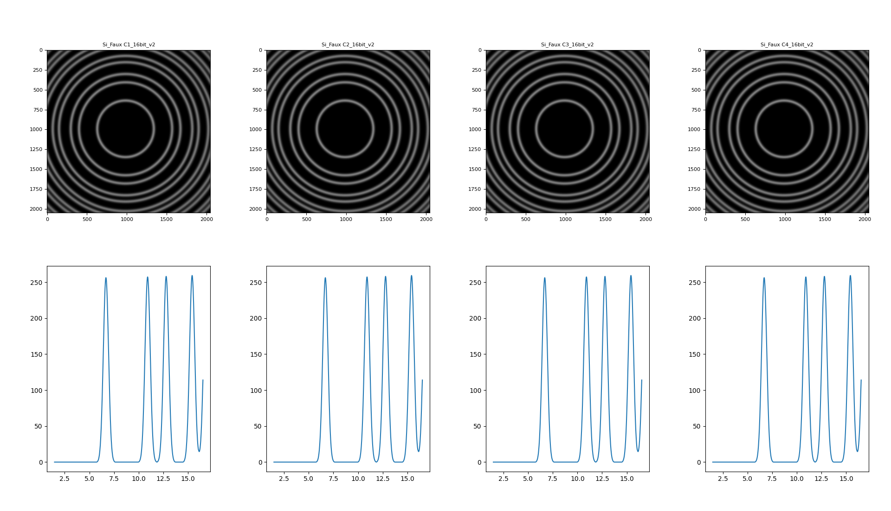
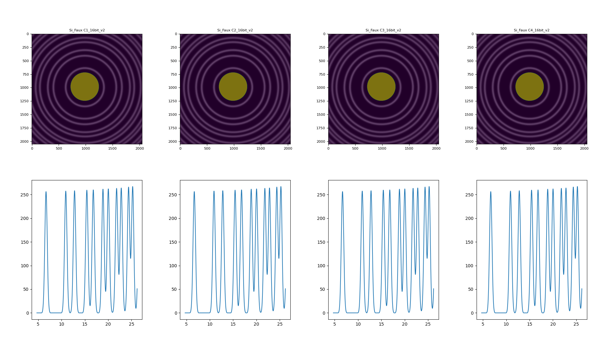

<h1>XRD Integration using pyFAI</h1>

### TOC

**A. [Create the anaconda environment (Skip if you already have one)](#1)**<br>

&nbsp;**A1. Create from a yml file**<br>
&nbsp;**A2. Create from scratch**

**B. [Prepare the necessary file(s): poni, edf, and tif (Skip if you already have these)](#2)**

**C. [Integrate Debye Ring Image(s)](#3)**

#### **References:**

1. pyFAI: <a href="https://pyfai.readthedocs.io/en/v2023.1/">https://pyfai.readthedocs.io/en/v2023.1/</a>
2. Dioptas: <a href="http://www.clemensprescher.com/programs/dioptas">http://www.clemensprescher.com/programs/dioptas</a>
3. Managing (conda) environments: <a href="https://conda.io/projects/conda/en/latest/user-guide/tasks/manage-environments.html">https://conda.io/projects/conda/en/latest/user-guide/tasks/manage-environments.html</a>

***

<h2>A. Create the anaconda environment (Skip if you have already created one)<a id="1"></a></h2>

<h3>A1. Create from a yml file</h3>

1. Open an anaconda prompt and type: conda env create -f pyFAI_python39.yml
2. Activate the newly created environment with: conda activate pyFAI_python39

<h3>A2. Create from scratch</h3>

Alternatively, you may create the anaconda environment from scratch.

1. Prepare conda environment: conda create -n pyFAI_python39 python=3.9
2. Activate the newly created environment with: conda activate pyFAI_python39
3. Install pyFAI: pip install pyfai   
4. install jupyter notebook: pip install notebook
5. Install the kernel: python -m ipykernel install --user --name pyFAI_python39 --display-name "pyFAI_python39"
6. pip install PyQt5
7. Install pyopencl: pip install pyopencl
8. Install matplotlib: pip install matplotlib
9. Run jupyter notebook: jupyter notebook 
10. Export environment into a .yml file: conda env export > pyFAI_python39.yml 

<h1>B. Prepare the necessary file(s): poni, edf, and tif (Skip if you already have these)<a id="2"></a></h2>

**Prepare tif:** 
The raw Debye ring images are available in tif files. Make sure to apply distortion correction to the tif files before performing the integration. 

**Prepare poni:** 
Use a distortion-corrected tif image of a standard Debye material (e.g., polycrystalline Si or CeO2) to generate the poni calibration file using (e.g., pyFAI or Dioptas).

A poni file can be viewed and edited using a notepad and has the following format:

```
# Nota: C-Order, 1 refers to the Y axis, 2 to the X axis 
# Calibration done at Sun Apr  2 19:00:08 2023
poni_version: 2
Detector: Detector
Detector_config: {"pixel1": 4.348e-05, "pixel2": 4.348e-05, "max_shape": [2048, 2048]}
Distance: 0.13162635726113767
Poni1: 0.04411428036828969
Poni2: 0.04172673442946006
Rot1: -0.00931213914094191
Rot2: -0.005579827855152664
Rot3: 1.7024448330784618e-09
Wavelength: 3.41554265656199e-11
```

As seen in the above, the poni calibration file consists of the following parameters:

- pixel1 and pixel2=detector pixel size in m
- max_shape=image pixel size in px
- Distance=sample to detector distance in m
- Poni1 and Poni2=x and y coordinates of the diect beam position
- Rot 1-3=detector angle or rotation about the three-axes 
- Wavelength=X-ray beam wavelength in m  

**Prepare edf:**
Mask out unwanted regions on the image and save the mask to an edf file (e.g., using pyFAI or Dioptas).

<h2>C. Integrate Debye Ring Image(s)<a id="3"></a></h2>

Required files:

- Distortion corrected Debye ring images (.tif)
- Calibration file (.poni)
- An optional mask file (.edf)


Folder structure:

```
root
+-create_a_montage_with_pyFAI.ipnyb
+-img
    +-Si_Faux C1_16bit_v2
    +-Si_Faux C2_16bit_v2
    +-Si_Faux C3_16bit_v2
    +-Si_Faux C4_16bit_v2
+-mask
    +-Mask_Test.edf
+-poni
    +-Si_Faux_C1.poni
    +-Si_Faux_C2.poni
    +-Si_Faux_C3.poni
    +-Si_Faux_C4.poni
```

Example 1:
Integrate four Si diffraction images using four separate poni files. The images and the poni files are paired according to the labels specified as ["C1", "C2", "C3", "C4"].

The output is presented as a montage showing the diffraction images and the corresponding poni files.

E.g.1:
Montage with labels and no masks.

```
import makepyfais

#display image on a Qt widget
%matplotlib qt

#make PyFAIs object. Specify labels as a list (optional)
pyFAIs=makepyfais.MakePyFAIs("poni", ["C1", "C2", "C3", "C4"])

#apply images and mask (optional)
dict_XRDs = pyFAIs.integrate("img")

#Create a montage
pyFAIs.create_a_montage()
```

Output:
</img>

E.g.2:
Montage with labels and masks.

```
import makepyfais

#display image on a Qt widget
%matplotlib qt

#make PyFAIs object. Specify labels as a list (optional)
pyFAIs=makepyfais.MakePyFAIs("poni_faux", ["C1", "C2", "C3", "C4"])

#apply images and mask (optional)
dict_XRDs = pyFAIs.integrate("img_faux", "mask")

#Create a montage
pyFAIs.create_a_montage()
```

Montage with masks.
</img>

***
